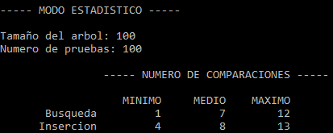
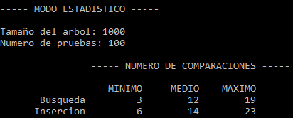
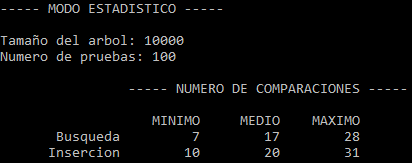
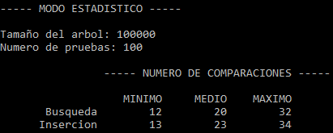

# Algoritmos y Estructuras de Datos Avanzadas

## Práctica 5: Implementación de un árbol binario de búsqueda (ABB)

### Objetivo

Desarrollar un tipo de dato genérico en lenguaje C++ que implemente un árbol binario de búsqueda y realizar un análisis del rendimiento del árbol binario de búsqueda al variar el número de nodos del árbol.

### Enunciado

Desarrollar en lenguaje C++ la plantilla de clases para el nodo binario de búsqueda y para el tipo abstracto de dato árbol binario de búsqueda, que implemente las operaciones de búsqueda, inserción y eliminación de una clave X en el ABB.

### Modo demostración

El programa crea un árbol binario de búsqueda vacío, y presenta un menú con las siguientes opciones:

1. Insertar clave
2. Eliminar clave
3. Salir

Tras cada operación se mostrará el árbol resultante mediante un recorrido por niveles. En cada nivel, se muestran los nodos de izquierda a derecha. El subárbol vacío se visualiza con [.]. En este programa se trabajará con árboles de tamaño limitado para permitir una correcta visualización.

### Modo estadístico

Para realizar el análisis del rendimiento de un árbol binario de búsqueda es necesario contar el número de operaciones de comparación de claves que se llevan a cabo al ejecutar una búsqueda. Ésto implica utilizar un contador de comparaciones, que se inicia a cero antes de una búsqueda en el árbol y se incrementa con cada ejecución del operador de comparación de claves. Al finalizar cada búsqueda en el ABB el valor obtenido en el contador de comparaciones se utiliza para actualizar una estadística que registra los valores mínimo, máximo y medio del número de comparaciones observados.

El programa realizará la siguiente secuencia de pasos:

1. Solicita los parámetros para crear un ABB:
    * N: Tamaño del árbol (número de nodos del árbol).
    * Número de pruebas, nPruebas. Número de repeticiones de la operación, inserción o búsqueda, que se realiza en el experimento.
    
2. Crear un banco de prueba con 2*N valores de tipo Matricula generados de forma aleatoria. El banco de pruebas se almacena en un vector.

3. Generar un árbol binario de búsqueda e insertar los N primeros valores del banco de prueba.

4. El experimento para estudiar el comportamiento de la operación de búsqueda consiste en:
    * Inicializar a cero los contadores de comparaciones de claves. Valores mínimo, acumulado y máximo.
    * Realizar la búsqueda de las nPruebas claves extraídas de forma aleatoria de las primeras N claves del banco de prueba, o sea, de las claves ya insertadas en el ABB. Para cada búsqueda se cuenta el número de comparaciones realizadas, y se actualizan los valores mínimo, máximo y acumulado.
    * Al finalizar el experimento se presentan los valores mínimo, máximo y medio del número de comparaciones de claves contabilizados.
    
5. El experimento para estudiar el comportamiento de la operación de inserción se basa en contar el número de comparaciones realizado para buscar claves que no se encuentran en el árbol. Consiste en:
    * Inicializar a cero los contadores de comparaciones de claves. Valores mínimo, acumulado y máximo.
    * Realizar la búsqueda de las nPruebas claves extraídas de forma aleatoria de las últimas N claves del banco de prueba, o sea, de las claves que no están insertadas en el ABB. Para cada búsqueda se cuenta el número de comparaciones realizadas, y se actualizan los valores mínimo, máximo y acumulado.
    * Al finalizar el experimento se presentan los valores mínimo, máximo y medio del número de comparaciones de claves contabilizados.

#### Análisis de la variación del comportamiento respecto del tamaño del ABB

Con el programa desarrollado, se ha realizado un análisis de la variación del comportamiento en el ABB a la hora tanto de buscar como de insertar cuando se incrementa el tamaño del mismo. Se ha mantenido el número de pruebas *nPruebas* en 100, cantidad suficiente para obtener unos datos fiables y mitigando la aparición de datos atípicos. Los resultados obtenidos han sido los siguientes:

* **Tamaño del ABB *N* = 100**

* **Tamaño del ABB *N* = 1000**

* **Tamaño del ABB *N* = 10000**

* **Tamaño del ABB *N* = 100000**

#### Conclusiones

A primera vista no parece que haya demasiado que analizar. Llama la atención lo poco que aumenta el número medio de comparaciones según aumenta el tamaño del árbol, por lo que podría ser un buen método de búsqueda para grandes cantidades de datos (árboles con gran tamaño).

Además, se puede ver cómo, por lo general, la inserción presenta un número de comparaciones algo mayor que la búsqueda, lo cual es lógico debido a que la inserción siempre acaba en un nodo hoja, mientras que la búsqueda, normalmente, termina en medio del árbol (es decir, no suele llegar hasta los nodos hoja). Aun así, la diferencia de comparaciones entre búsqueda e inserción no llega a ser significativa.

En general, podríamos decir que se trata de una estructura bastante eficiente (incluso con grandes cantidades de datos).

***NOTA:*** **Este análisis y sus conclusiones se basan en el número de comparaciones que realizan los métodos de búsqueda e inserción, no en el tiempo de ejecución de los mismos. Un análisis basado en el tiempo de ejecución podría dar lugar a resultados totalmente diferentes.**

### Compilación y ejecución

El ejecutable generado se guarda en *bin/*

~~~
    make run
~~~

### Información personal

**Autor:** [Kevin Estévez Expósito](https://alu0100821390.github.io/)

**ULL-ID:** alu0100821390
